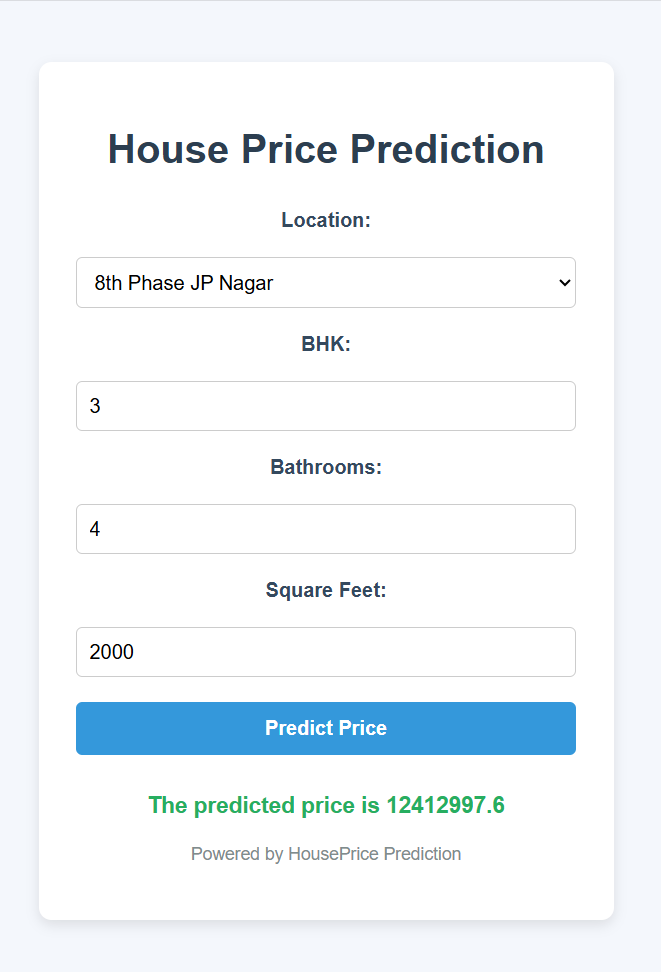

# House Price Prediction System

## Table of Contents

- Features
- Technologies Used
- Usage
- Example
- File Structure
- Screenshots
- Contributing

## Features

- **House Price Prediction**: Predicts the price of a house based on user input (e.g., location, number of bedrooms, bathrooms, square footage).
- **Interactive User Input**: Allows users to input features like location, BHK (bedrooms), bathrooms, and area (square feet) for real-time predictions.
- **Machine Learning Model**: The model is built using a regression model (e.g., Ridge Regression, Random Forest, etc.) for accurate predictions.
- **Web Interface**: A user-friendly web interface built with HTML, CSS, and JavaScript for entering data and displaying predictions.

## Technologies Used

- **Python 3.x**: Programming language.
- **Flask**: For creating the web application.
- **pandas**: For data manipulation and handling the dataset.
- **numpy**: For numerical operations.
- **scikit-learn**: For building and evaluating the machine learning model.
- **Pickle**: For saving and loading the trained model.
- **HTML/CSS/JavaScript**: For creating the web interface.

## Usage

### How to Use

1. **Clone the repository**:
    ```bash
    git clone https://github.com/Tusharr06/House-Price-Prediction-System.git
    cd House-Price-Prediction-System
    ```

2. **Install Dependencies**:
    Install the required Python packages using pip:
    ```bash
    pip install -r requirements.txt
    ```

    Alternatively, you can install the dependencies manually:
    ```bash
    pip install pandas numpy scikit-learn flask
    ```

3. **Run the Application**:
    Execute the Flask application:
    ```bash
    python app.py
    ```

4. **Open the Web Application**:
    Open your web browser and go to `http://127.0.0.1:8080/`.

5. **Enter User Data**:
    Use the web form to enter the following house-related information:
    - Location
    - Number of Bedrooms (BHK)
    - Number of Bathrooms
    - Square Feet Area

6. **Get the Prediction**:
    After entering the data, click the "Predict Price" button to see the predicted price of the house.

### Example

Here are some example values you can use to test the form:

- **Location**: Bangalore
- **Number of Bedrooms (BHK)**: 3
- **Number of Bathrooms**: 2
- **Square Feet Area**: 1200

After entering these values, the model will predict the price of the house.

## File Structure

- `app.py`: The main Flask application file.
- `templates/index.html`: The HTML file for the web interface.
- `static/styles.css`: The CSS file for styling the web interface.
- `static/script.js`: The JavaScript file for handling form submission and displaying results.
- `HousePriceModel.pkl`: The trained model file (Pickle file).

## Screenshots




## Contributing

If you would like to contribute to this project, please fork the repository and submit a pull request. For major changes, please open an issue first to discuss what you would like to change.

